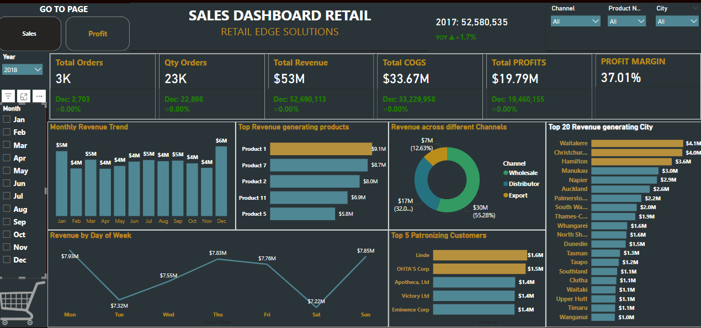
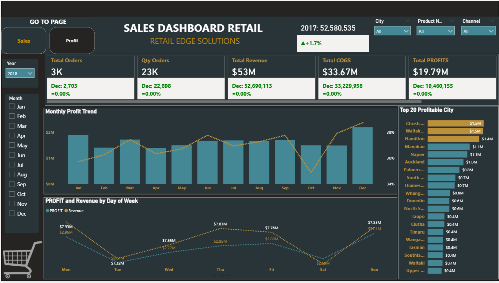

# 📊 Retail Sales Performance & Profitability Dashboard (Power BI)

## 🧠 Project Overview

RetailEdge Solutions operates across multiple cities and sales channels, including **physical retail stores and e-commerce platforms**.

As the business scaled, sales data became fragmented across systems, limiting visibility into performance trends, profitability drivers and customer behaviour.

This project delivers a **commercial-grade Power BI dashboard** that consolidates multi-channel sales data into a single, interactive analytics solution for monitoring performance and supporting strategic decision-making.

---

## ❗ Problem Statement

- Sales data across online and in-store channels was **dispersed and difficult to analyse holistically**
- Management lacked visibility into **profitability drivers and year-over-year performance**
- Identifying **top-performing products, cities and customers** required manual effort
- No centralised dashboard existed to monitor **KPIs and business performance in real time**

---

## 🎯 Project Objectives

- Develop an interactive dashboard to monitor:
  - Revenue  
  - Profit  
  - Orders  
  - Profit Margin  
- Enable **year-over-year comparison**
- Identify:
  - Top-performing cities  
  - High-value customers  
  - Best-selling products  
  - Channel contribution  
- Provide **data-driven insights for strategic decision-making**

---

## ⚙️ Technical Implementation

- Data cleaning and transformation using **Power Query**
- Data modelling and KPI creation using **DAX**
- Interactive dashboard design with dynamic filters:
  - Year  
  - Month  
  - City  
  - Product  
  - Channel  
- Multi-page dashboard:
  - Sales Performance Overview  
  - Profitability Analysis  

---

## 📥 Access Project Files

### 🔹 Interactive Dashboard (Power BI)

Download the full interactive dashboard:

➡️ **[Download Power BI Dashboard](dashboard/retail_sales_dashboard.pbix)**  
*(Open using Microsoft Power BI Desktop)*

---

### 🔹 Dataset

Access the dataset used for this project:

➡️ **[📂 View Dataset Folder](datasets/)**


---

## 🖼️ Dashboard Preview

### 🔹 Sales Performance Overview



### 🔹 Profitability Analysis



---

## 📈 Key Metrics

### Sales Overview (All Channels)
- Total Revenue: **$155M**
- Total Profit: **$57.79M**
- Total Orders: **8K**
- Quantity Sold: **68K Units**
- Cost of Goods Sold: **$96.78M**

### Profit Analysis (2018)
- Revenue: **$53M**
- Profit: **$19.79M**
- Profit Margin: **37.01%**
- Orders: **3K**
- Quantity Sold: **23K Units**

---

## 💡 Key Insights

- Wholesale channel contributed approximately **55% of total revenue (~$30M in selected view)**  
- Top-performing product generated **~$9.1M in revenue**, indicating product concentration  
- Waitakere and Christchurch were the **highest revenue-generating cities (~$4M each)**  
- Top 5 customers contributed over **$7M combined revenue**, showing customer concentration  
- Monthly revenue remained stable between **$4M–$6M**, indicating consistent demand  
- Profit margins peaked at **~37%**, reflecting strong profitability  
- Sales performance increased towards **year-end (Nov–Dec)**  
- Weekend sales showed variation, with **Saturday recording lower revenue (~$2.6M)**  

---

## 🚀 Business Impact

This dashboard enables stakeholders to:

- Monitor KPIs and performance trends in **real time**  
- Identify high-performing products, regions and customers  
- Understand profitability drivers  
- Reduce manual reporting effort  
- Support **data-driven strategic decision-making**

---

## 🛠️ Tools & Technologies

- Power BI  
- DAX  
- Power Query  
- Excel  

---

## 📁 Repository Structure

```
Retail-Sales-Performance-Dashboard/
│
├── dashboard/
│   └── retail_sales_dashboard.pbix
│
├── dataset/
│   └── retail_sales_data.csv
│
├── screenshots/
│   ├── sales_overview.png
│   └── profit_analysis.png
│
└── README.md
```

---

## 👤 Author

**Oluwasegun Balogun**  
Data Analyst | Business Intelligence  

🔗 LinkedIn  
https://www.linkedin.com/in/oluwasegun-balogun  

📧 Email  
segbalogun@yahoo.com
